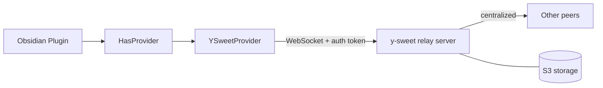
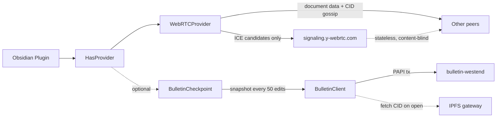
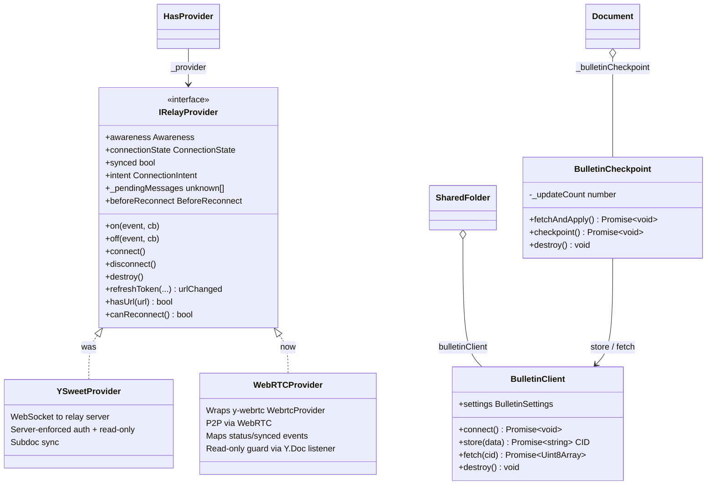
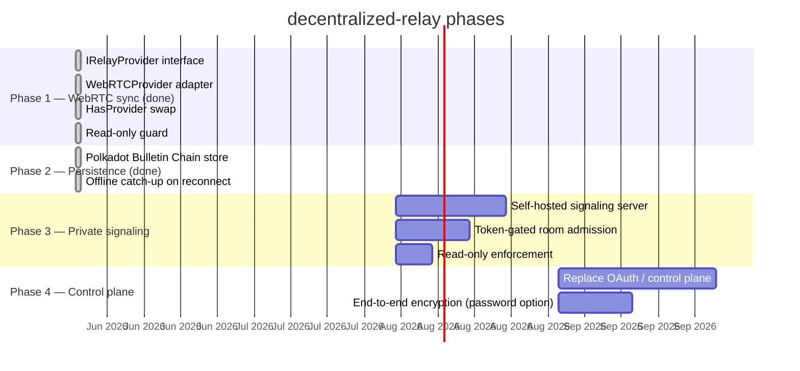
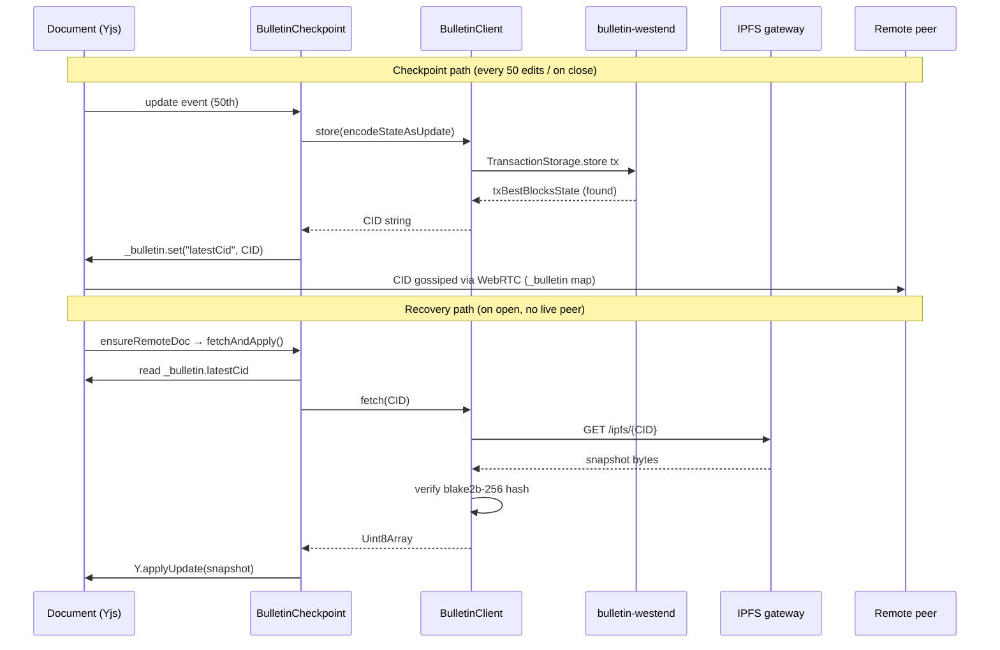

# decentralized-relay

> **Fork of [Relay](https://github.com/No-Instructions/Relay) by [System 3](https://system3.md/), used under the MIT License.**
> Original authors: Daniel Grossmann-Kavanagh and contributors.

This fork replaces the centralized y-sweet relay server with peer-to-peer WebRTC sync
using [y-webrtc](https://github.com/yjs/y-webrtc). Document content never touches a central server.
The control plane (OAuth, shared folder management) is unchanged.

---

## What changed

### Architecture

**Before (upstream Relay):**



**After (this fork):**



Document content travels peer-to-peer. The signaling server sees only room names (= doc IDs) and ICE candidates — never document data. The dashed Bulletin Chain path is optional and disabled by default.

### Provider swap

The core change is a new adapter class that wraps `y-webrtc`'s `WebrtcProvider` behind the same interface that `HasProvider` already expected from `YSweetProvider`.



### Files changed

**Phase 1 — WebRTC provider swap:**

| File | Change |
|---|---|
| `package.json` | Added `y-webrtc ^10.3.0` |
| `src/client/provider.ts` | Appended `IRelayProvider` interface (reuses existing types) |
| `src/client/webrtc-provider.ts` | **New.** `WebRTCProvider` adapter wrapping `WebrtcProvider` |
| `src/client/__tests__/webrtc-provider.test.ts` | **New.** 22 unit tests (mocked y-webrtc) |
| `src/HasProvider.ts` | `makeProvider()` constructs `WebRTCProvider`; `_provider` typed as `IRelayProvider`; removed `debuggerUrl`; simplified `deferDisconnectForPendingMessages()` |
| `src/SharedFolder.ts` | `subscribeToEvents` call made optional (`?.`) for provider compat |

**Phase 2 — Bulletin Chain persistence:**

| File | Change |
|---|---|
| `package.json` | Added `polkadot-api`, `@polkadot/keyring`, `@polkadot/util-crypto`, `@polkadot-api/signer`, `multiformats`, `@polkadot-api/cli` |
| `.papi/` | **New.** Generated PAPI descriptors for `bulletin-westend` chain |
| `src/bulletin/types.ts` | **New.** `BulletinSettings` interface + `DEFAULT_BULLETIN_SETTINGS` |
| `src/bulletin/BulletinClient.ts` | **New.** PAPI WebSocket client: `store(data)` → submits tx + returns CID; `fetch(cid)` → retrieves from IPFS gateway with CID format validation + blake2b-256 content integrity check |
| `src/bulletin/BulletinCheckpoint.ts` | **New.** Per-document coordinator: counts Yjs updates, fires checkpoint at 50, `fetchAndApply()` on open |
| `src/bulletin/__tests__/bulletin-client.test.ts` | **New.** 5 unit tests for BulletinClient |
| `src/bulletin/__tests__/bulletin-checkpoint.test.ts` | **New.** 7 unit tests for BulletinCheckpoint |
| `src/main.ts` | `RelaySettings` extends `BulletinSettings`; `Live` creates/destroys `BulletinClient` in lifecycle; injects into `SharedFolder` |
| `src/SharedFolder.ts` | Added `public bulletinClient: BulletinClient \| null` |
| `src/Document.ts` | `ensureRemoteDoc()` creates `BulletinCheckpoint` + calls `fetchAndApply()`; added `destroyRemoteDoc()` override that fires final checkpoint |
| `src/components/BulletinSettingsSection.svelte` | **New.** Settings UI: enable toggle, RPC URL, keyfile path, password, IPFS gateway |
| `src/components/PluginSettings.svelte` | Added `<BulletinSettingsSection>` to settings panel |

### Behaviour mapping

| YSweetProvider behaviour | WebRTCProvider equivalent |
|---|---|
| `status` event → `{ status, intent }` | Inner `status` event remapped from `{ connected }` |
| `synced` event → `boolean` | Inner `synced` event remapped from `{ synced }` |
| `connection-close` event | Emitted when inner `status.connected === false` |
| `refreshToken(url, …)` | No-op — returns `{ urlChanged: false }` |
| `hasUrl(url)` | Always `true` |
| `canReconnect()` | Always `true` |
| `_pendingMessages` | Always `[]` |
| `readOnly` enforced by server | Console error on local writes (see Limitations) |

---

## Known limitations

### Security / access control

| Limitation | Detail |
|---|---|
| **No transport-level auth** | Room name = `clientToken.docId` (non-guessable GUID). Any peer who learns the docId can join. The signaling server is public and content-blind. |
| **Read-only not enforced** | WebRTC is symmetric — there is no server to reject writes from read-only clients. `WebRTCProvider` logs a `console.error` when a local write occurs on a read-only token. Full enforcement requires a gated signaling server. |
| **No encryption** | y-webrtc supports a `password` option (AES-CBC) that is not yet wired up. Until then, informal privacy depends entirely on docId non-guessability. |

### Protocol gaps

| Limitation | Detail |
|---|---|
| **Offline persistence (experimental)** | The optional Bulletin Chain backup (disabled by default) snapshots documents to the Polkadot Bulletin Chain testnet. Reconnecting peers can catch up from the chain when no live peer is available. Requires a funded sr25519 keypair on bulletin-westend and a configured RPC URL. See Settings → Bulletin Chain. |
| **Subdoc sync disabled** | `subscribeToEvents`, `getSubdocQueryDocIds`, `onSubdocIndex` are y-sweet–specific. `WebRTCProvider` exposes them as optional no-ops. Subdoc indexing does not work. |
| **No `connection-error` on ICE failure** | y-webrtc does not surface ICE negotiation failures as an event. |
| **Signaling still centralised** | `wss://signaling.y-webrtc.com` is a public server run by the y-webrtc maintainer. It is stateless and content-blind but is still a single point of failure. |

---

## Roadmap



### Phase 2 — Persistence (Polkadot Bulletin Chain) ✓ done

The optional Bulletin Chain backup snapshots Yjs document state to the [Polkadot Bulletin Chain](https://github.com/paritytech/polkadot-bulletin-chain) testnet (bulletin-westend). Every 50 edits, and on document close, a snapshot is written to the chain and its CID is distributed to peers via a `_bulletin` Y.Map inside the shared document. On open, `fetchAndApply()` retrieves the last known snapshot and merges it before WebRTC connects — giving reconnecting peers a starting point even when no live peer is available.



**Remaining gaps:** Account authorization on the testnet faucet is not automated; the keyfile password is stored in `data.json` plaintext; the final checkpoint on close is best-effort (fire-and-forget over WebSocket).

### Phase 3 — Private signaling

Replace `wss://signaling.y-webrtc.com` with a self-hosted signaling server that:
- Validates `clientToken.token` before admitting a peer to a room
- Rejects write-intent connections from read-only tokens
- Provides `connection-error` events on ICE failure

### Phase 4 — Control plane

Replace the System 3 OAuth / control plane with a decentralised identity and permissioning layer. At this point `clientToken.token` and `clientToken.url` can be fully removed.

---

## Development

```bash
npm install
npm run build   # tsc + esbuild (develop profile)
npm test        # jest unit tests (34 tests: 22 WebRTC + 12 Bulletin Chain)
```

The encrypted test files copied from the upstream repo (`__tests__/**` except `src/client/__tests__/`) require the upstream git-crypt key and cannot be run in this fork without it.

---

# Relay 🛰️ (original README)

True **multiplayer mode** for Obsidian. 💃🕺

-   **Collaborate in real time** with live cursors.
-   **Edit offline** and sync seamlessly when you're back on.
-   **Share folders** and manage access to updates.


Relay is a collaborative editing plugin for Obsidian by [System 3](https://system3.md/). It uses CRDTs to enable snappy, local-first, real-time and asynchronous collaboration.

[Join our Discord](https://discord.system3.md) for support and a good time.

### How does Relay work?

In a nutshell, Relay:

1. **Tracks updates to designated folders**. The plugin uses conflict-free replicated data types (CRDTs) to track updates to folders that you designate within your vault.
2. **Relays updates.** It sends those updates up to Relay servers 🛰️, which then echo the updates out to all collaborators on the relay.
3. **Integrates updates.** Your collaborator receives the updates and integrates them seamlessly as they come in.

### What's a CRDT?

Great question. CRDT stands for **conflict-free replicated data type** and it's a technology that's critical to making local-first real-time collaboration work.

> The fundamental idea is this: You have data. This data is stored on multiple replicas. CRDTs describe how to coordinate these replicas to always arrive at a consistent state. [1]

For a great intro and overview, watch the first 10 minutes of this video by Martin Kleppmann. If you want to get into the nitty-gritty, watch the whole thing.

[](https://youtube.com/watch?v=x7drE24geUw)

For more, check out this video: [Intro to the Modern State of Synchronization](https://youtu.be/tSvlvMTHhWY?si=Rp6FepkeS7N6y3zO) by [Kevin Jahns](https://github.com/dmonad). Jahns is the maintainer of [Yjs](https://docs.yjs.dev/), which is the open source CRDT that we use in Relay.

## What can I do with Relay?

Oh, the things you can do.

Here's a video tour:  
[](https://youtu.be/Ol6zDF5vrZo)


### Create a new relay

1. Go to Obsidian settings (gear icon in lower left of Obsidian)
2. Go to Relay settings (on the left, at the bottom)
3. Create new relay
4. Add shared folder(s) to the relay


### Add users to the relay by giving them a share key

1. Go to settings for your relay
2. Grab the share key
3. Give it to your people


### Collaborate to your heart's content

-   If you're in a note at the same time, you'll see each others' cursors
-   You can edit the same block at the same time (magic of CRDTs)
-   You can edit offline and it'll all be fine when you come back on (CRDTs ftw)
-   If you hit any bugs or have questions/requests let us know in the [Discord](https://discord.system3.md)

### Kick user from a relay

-   Right now anyone with the share key can join the relay
-   So you can kick the user but they could rejoin if they want
-   We'll be adding stricter sharing options in the future


### Join someone else's relay

1. Get their share key
2. Use it to join their relay
3. Add the folders you want to your vault


### Destroy the relay when you're done

If you're the owner of a relay, you can destroy the copy on the server.

If you're a member but not the owner, you can leave the relay (destroy your connection to the server), and you can destroy the local data.

## FAQ

Asked more or less frequently.

### Which file types are supported?

Relay currently has two types of storage, document storage and attachment storage.
Document storage is backed by our real-time CRDT servers, while Attachments are stored as file blobs.

Document storage:
-   Folders
-   Markdown files

Attachment storage:
-   Images
-   Audio
-   Video
-   PDFs
-   Other files (must be enabled in settings)


You need to have available Attachment storage in order to sync images/audio/video/PDFs/etc.


### How much does Relay cost?

#### Free ($0)
- Up to 3 users
- 2 devices per user
- Unlimited markdown files
- No cloud storage (0 MB)
- Self-hosted deployment
- Cloud deployment (.md only)
- BYO Relay Server
- BYO storage (unmetered, self-host only)
- Community support

#### Hobby ($5 per month total)
- Up to 6 users
- 3 devices per user
- Unlimited markdown files
- 10GB cloud storage included
- Self-hosted deployment
- BYO Relay Server
- BYO storage (unmetered, self-host only)
- Community support

#### Starter ($6 per user per month)
- Unlimited users
- 6 devices per user
- Unlimited markdown files
- 20GB + 5GB/user cloud storage included
- Self-hosted deployment
- BYO Relay Server
- BYO storage (unmetered)
- Role-based access control
- Single sign-on
- Private Discord
- Email support


We offer discounts for educational use.


### Do I need to be online to use Relay?

Relay is local-first -- this means that all of your edits are tracked locally and the server is used to _relay_ the edits to your collaborators. You can work offline and your edits will be merged once you come back online.

### How are edits merged?

We use a **Conflict-Free Replicable Data Types** (CRDTs) provided by the excellent yjs library.

### Is Relay Open Source?

The Obsidian plugin code is MIT licensed (this repo).

The [Relay Server](https://github.com/No-Instructions/y-sweet) is a fork of y-sweet and is MIT licensed. 

Our login, permissions, and billing server code is proprietary.


### Can I self-host?

We support "On-Prem" deployment of a Relay Server.

If you self-host your Relay Server on a private network then your users will still perform login and permissions checks through our servers, but they will connect directly to your server. Your content will be completely private and inaccessible by us.

For instructions on hosting your Relay Server on fly.io, see [Relay Server Template](https://github.com/No-Instructions/relay-server-template).

[Join our Discord](https://discord.system3.md) for help on configuring your on-prem deployment.


### Who's behind Relay?

Relay is made by [System 3](https://system3.md/). The legal entity behind System 3 is [No Instructions, LLC](http://noinstructions.ai/).

Right now the whole operation is two people:

-   Dan, a software engineer who has worked at places like [Planet](http://planet.com/) and [Benchling](https://www.benchling.com/)
-   Matt, a product manager and psychotherapist (in training) who has worked at places like [Meta AI](https://ai.meta.com/meta-ai/), [Lumosity](https://www.lumosity.com/en/), and [Big Health](https://www.bighealth.com/)


## Do you have a privacy policy?

Yes: [https://system3.md/Privacy+policy](https://system3.md/Privacy+policy).


## How can I make a responsible security disclosure?

Please email security@system3.md


## Installing Relay

You can search for `Relay` in the Obsidian Community plugins list,
or click this [Obsidian Plugin Link](https://obsidian.md/plugins?search=system3-relay).


[Join our Discord](https://discord.system3.md)!

---

[1] Intro to CRDTs by Lars Hupel [https://lars.hupel.info/topics/crdt/01-intro/](https://lars.hupel.info/topics/crdt/01-intro/)
