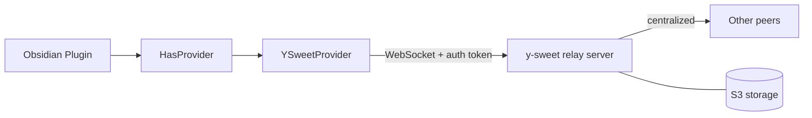
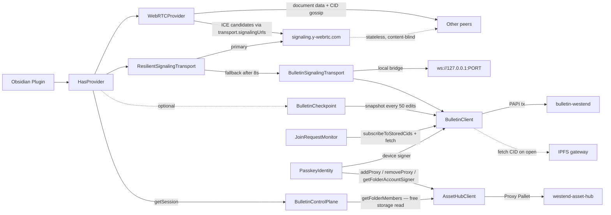
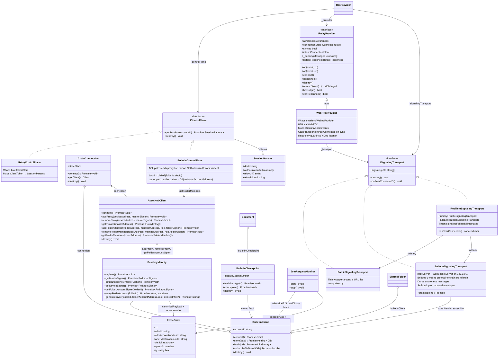
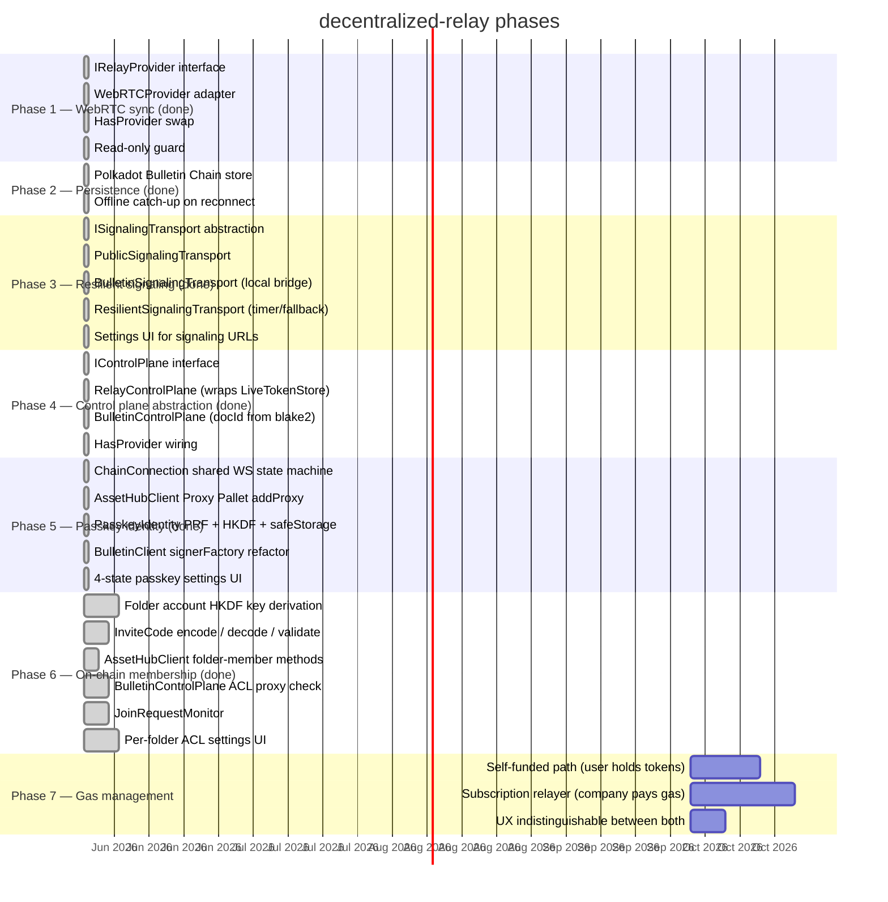
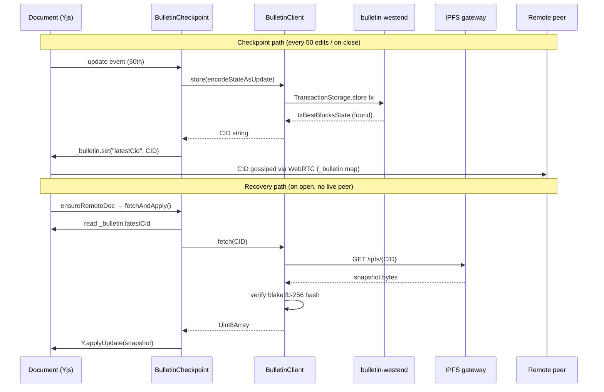
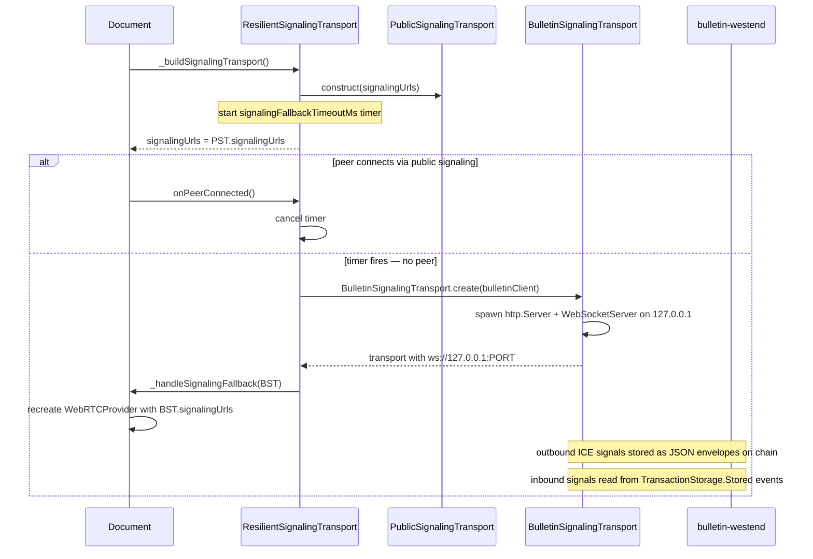
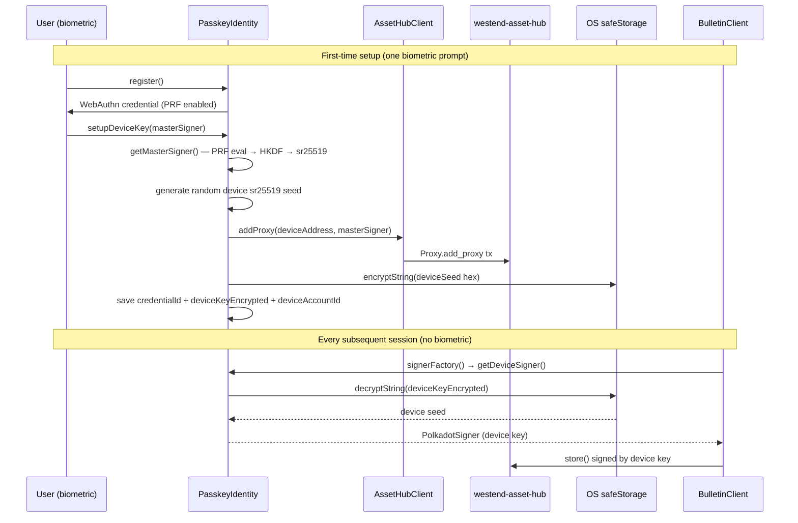
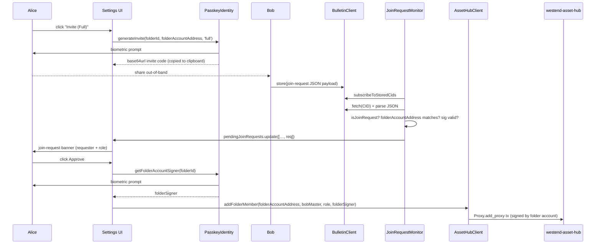

# decentralized-relay

> **Fork of [Relay](https://github.com/No-Instructions/Relay) by [System 3](https://system3.md/), used under the MIT License.**
> Original authors: Daniel Grossmann-Kavanagh and contributors.

This fork replaces the centralized y-sweet relay server with peer-to-peer WebRTC sync
using [y-webrtc](https://github.com/yjs/y-webrtc). Document content never touches a central server.
The control plane (OAuth, shared folder management) is being decentralised iteratively — see Roadmap.

---

## What changed

### Architecture

**Before (upstream Relay):**



**After (this fork):**



Document content travels peer-to-peer. The signaling server sees only room names (= doc IDs) and ICE candidates — never document data. `ResilientSignalingTransport` tries the public server first; if no peer connects within 8 seconds it switches to a local WebSocket bridge backed by the Bulletin Chain. All signaling paths are optional and disabled by default without a configured Bulletin Chain keypair. `BulletinControlPlane` verifies folder membership by reading the proxy list on Asset Hub — a free storage read, no tx required. `JoinRequestMonitor` watches Bulletin Chain for signed join-request payloads and fires a callback for the folder owner to approve.

### Provider swap

The core change is a new adapter class that wraps `y-webrtc`'s `WebrtcProvider` behind the same interface that `HasProvider` already expected from `YSweetProvider`.



### Files changed

**Phase 1 — WebRTC provider swap:**

| File | Change |
|---|---|
| `package.json` | Added `y-webrtc ^10.3.0` |
| `src/client/provider.ts` | Appended `IRelayProvider` interface (reuses existing types) |
| `src/client/webrtc-provider.ts` | **New.** `WebRTCProvider` adapter wrapping `WebrtcProvider` |
| `src/client/__tests__/webrtc-provider.test.ts` | **New.** 22 unit tests (mocked y-webrtc) |
| `src/HasProvider.ts` | `makeProvider()` constructs `WebRTCProvider`; `_provider` typed as `IRelayProvider`; removed `debuggerUrl`; simplified `deferDisconnectForPendingMessages()` |
| `src/SharedFolder.ts` | `subscribeToEvents` call made optional (`?.`) for provider compat |

**Phase 2 — Bulletin Chain persistence:**

| File | Change |
|---|---|
| `package.json` | Added `polkadot-api`, `@polkadot/keyring`, `@polkadot/util-crypto`, `@polkadot-api/signer`, `multiformats`, `@polkadot-api/cli` |
| `.papi/` | **New.** Generated PAPI descriptors for `bulletin-westend` chain |
| `src/bulletin/types.ts` | **New.** `BulletinSettings` interface + `DEFAULT_BULLETIN_SETTINGS` |
| `src/bulletin/BulletinClient.ts` | **New.** PAPI WebSocket client: `store(data)` → submits tx + returns CID; `fetch(cid)` → retrieves from IPFS gateway with CID format validation + blake2b-256 content integrity check |
| `src/bulletin/BulletinCheckpoint.ts` | **New.** Per-document coordinator: counts Yjs updates, fires checkpoint at 50, `fetchAndApply()` on open |
| `src/bulletin/__tests__/bulletin-client.test.ts` | **New.** 5 unit tests for BulletinClient |
| `src/bulletin/__tests__/bulletin-checkpoint.test.ts` | **New.** 7 unit tests for BulletinCheckpoint |
| `src/main.ts` | `RelaySettings` extends `BulletinSettings`; `Live` creates/destroys `BulletinClient` in lifecycle; injects into `SharedFolder` |
| `src/SharedFolder.ts` | Added `public bulletinClient: BulletinClient \| null` |
| `src/Document.ts` | `ensureRemoteDoc()` creates `BulletinCheckpoint` + calls `fetchAndApply()`; added `destroyRemoteDoc()` override that fires final checkpoint |
| `src/components/BulletinSettingsSection.svelte` | **New.** Settings UI: enable toggle, RPC URL, keyfile path, password, IPFS gateway |
| `src/components/PluginSettings.svelte` | Added `<BulletinSettingsSection>` to settings panel |

**Phase 3 — Modular resilient signaling:**

| File | Change |
|---|---|
| `package.json` | Added `ws` + `@types/ws` for the local signaling bridge server |
| `src/bulletin/types.ts` | Added `signalingUrls: string[]` and `signalingFallbackTimeoutMs: number` to `BulletinSettings` |
| `src/bulletin/BulletinClient.ts` | Added `accountId` getter (SS58 address) and `subscribeToStoredCids(cb)` (block-event stream) |
| `src/bulletin/__tests__/bulletin-client.test.ts` | +5 tests for new `BulletinClient` methods (total: 10) |
| `src/signaling/ISignalingTransport.ts` | **New.** Interface: `signalingUrls`, `destroy()`, optional `onPeerConnected()` |
| `src/signaling/PublicSignalingTransport.ts` | **New.** Thin wrapper around a URL list; no-op destroy |
| `src/signaling/BulletinSignalingTransport.ts` | **New.** Spawns a local `http.Server` + `WebSocketServer`; bridges y-webrtc signaling to chain `store`/`fetch`; filters awareness messages and deduplicates own-account envelopes |
| `src/signaling/ResilientSignalingTransport.ts` | **New.** Starts with `PublicSignalingTransport`; starts a timer on construction; fires `onFallback(BulletinSignalingTransport)` if no peer connects in time; `onPeerConnected()` cancels the timer |
| `src/signaling/__tests__/public-signaling.test.ts` | **New.** 5 tests |
| `src/signaling/__tests__/bulletin-signaling.test.ts` | **New.** 8 tests |
| `src/signaling/__tests__/resilient-signaling.test.ts` | **New.** 6 tests |
| `src/client/webrtc-provider.ts` | Accepts `transport?: ISignalingTransport` option; calls `transport.onPeerConnected?.()` on first sync; `destroy()` also calls `transport.destroy()` |
| `src/client/__tests__/webrtc-provider.test.ts` | +2 tests for transport option and `onPeerConnected` (total: 24) |
| `src/HasProvider.ts` | Added `_buildSignalingTransport()` (returns `PublicSignalingTransport`); `_handleSignalingFallback()` (swaps provider); threads transport through `ensureRemoteDoc()` |
| `src/Document.ts` | Overrides `_buildSignalingTransport()` — returns `ResilientSignalingTransport` when `bulletinClient` is available |
| `src/components/BulletinSettingsSection.svelte` | Added signaling servers textarea and fallback timeout number input |

**Phase 4 — Control plane abstraction:**

| File | Change |
|---|---|
| `src/control-plane/IControlPlane.ts` | **New.** `SessionParams` type + `IControlPlane` interface — replaces `ClientToken` as the session data contract for `HasProvider` |
| `src/control-plane/RelayControlPlane.ts` | **New.** Wraps `LiveTokenStore`; maps `ClientToken` fields to `SessionParams`; no-op background-refresh callback (token freshness via `beforeReconnect`) |
| `src/control-plane/BulletinControlPlane.ts` | **New.** Pure computation — derives `docId` from blake2 hash of `folderId:documentId`; no network call; `authorization` always `full` |
| `src/control-plane/__tests__/relay-control-plane.test.ts` | **New.** 7 unit tests for `RelayControlPlane` |
| `src/control-plane/__tests__/bulletin-control-plane.test.ts` | **New.** 8 unit tests for `BulletinControlPlane` |
| `src/bulletin/types.ts` | Added `bulletinControlPlaneEnabled: boolean` (default `false`) to `BulletinSettings` |
| `src/HasProvider.ts` | `clientToken: ClientToken` → `sessionParams: SessionParams`; added `_controlPlane: IControlPlane` constructor param; extracted `_createProvider()` private method; deferred provider creation when `docId` is sentinel (decentralized path); `getProviderToken()` → `getSessionParams()`; `refreshProvider()` only calls relay `refreshToken()` when `relayUrl` present; `providerActive()` simplified; `onceConnected()`/`onceProviderSynced()` guarded against null provider in deferred path; sentinel extracted to `DEFERRED_DOC_ID` constant |
| `src/SharedFolder.ts` | Added `public controlPlane: IControlPlane`; added `controlPlane` constructor parameter; passed to `super()` |
| `src/Document.ts` | Passed `parent.controlPlane` to `super()`; null guard in `acquireLock()` for deferred provider path |
| `src/Canvas.ts` | Passed `parent.controlPlane` to `super()` |
| `src/main.ts` | Added `_buildControlPlane()` private method (returns `BulletinControlPlane` or `RelayControlPlane` based on settings); passes result to `SharedFolder` constructor |
| `src/BackgroundSync.ts` | Replaced stale `getProviderToken()` call with direct `tokenStore.getToken()` (relay-only download path) |

**Phase 6 — On-chain membership:**

| File | Change |
|---|---|
| `src/asset-hub/types.ts` | Added `FolderMember` interface (`masterAccount: string`, `role: 'full' \| 'read-only'`) |
| `src/asset-hub/AssetHubClient.ts` | Added `addFolderMember`, `removeFolderMember` (role-aware), `getFolderMembers` — wrap `Proxy.add_proxy` / `remove_proxy` / `Proxies` storage calls on the folder account |
| `src/asset-hub/__tests__/asset-hub-client.test.ts` | +7 unit tests for new folder-member methods (total: 12) |
| `src/acl/InviteCode.ts` | **New.** `encodeInvite` / `decodeInvite` (base64url) + `validateInvite` (expiry + sr25519 signature via `signatureVerify`) + `canonicalPayload` (sorted-key JSON, excludes `sig`) |
| `src/acl/__tests__/invite-code.test.ts` | **New.** 8 unit tests (round-trip, bad sig, expiry, canonical stability) |
| `src/passkey/PasskeyIdentity.ts` | Extracted `_getMasterSeed()`; refactored `_hkdf` to accept `info` param; added `getFolderAccountSigner(folderId)` (HKDF from master seed + folder UUID), `setupFolderAccount(folderId)` → ss58 address, `generateInvite(folderId, folderAccountAddress, role, expiresInMs?)` |
| `src/passkey/__tests__/passkey-identity.test.ts` | +5 unit tests for three new methods (total: 15) |
| `src/control-plane/IControlPlane.ts` | Added `NotAuthorizedError` class |
| `src/control-plane/BulletinControlPlane.ts` | Changed constructor to accept 3 injected deps (`assetHubClient`, `getMyMasterAccountId`, `getFolderAccountAddress`); `getSession` now performs ACL check — owner path (no `folderAccountAddress`) returns `full`; ACL path reads proxy list and throws `NotAuthorizedError` if caller absent |
| `src/control-plane/__tests__/bulletin-control-plane.test.ts` | Replaced with 11 tests covering owner path, ACL path (full / read-only / unauthorized / null identity), and destroy |
| `src/acl/JoinRequestMonitor.ts` | **New.** Subscribes to `BulletinClient.subscribeToStoredCids`; validates shape + folder match + invite signature; fires `onRequest` callback; idempotent `start()` / `stop()` |
| `src/acl/__tests__/join-request-monitor.test.ts` | **New.** 6 unit tests (valid request fires, non-join-request skipped, unknown folder skipped, bad sig skipped, stop unsubscribes, start idempotent) |
| `src/SharedFolder.ts` | Added `folderAccountAddress?: string` to `SharedFolderSettings`; `get folderAccountAddress()` and `updateFolderAccountAddress()` on `SharedFolder` |
| `src/main.ts` | `_buildControlPlane` now accepts `folderSettings` and wires per-folder address lookup; added `_joinRequestMonitor` field + `pendingJoinRequests: Writable<JoinRequest[]>` store; `JoinRequestMonitor` started after `bulletinClient` init; torn down before `assetHubClient` |
| `src/components/BulletinSettingsSection.svelte` | Full replacement: per-folder ACL section (setup button → address → invite / member list / revoke / join-request banners) + existing Passkey Identity section |

**Phase 5 — Passkey identity:**

| File | Change |
|---|---|
| `.papi/metadata/westend_asset_hub.scale` | **New.** PAPI descriptor for Westend Asset Hub (Proxy Pallet) |
| `.papi/polkadot-api.json` | Added `westend_asset_hub` chain entry |
| `src/chain/ChainConnection.ts` | **New.** Shared WS + PAPI state machine (`idle → connecting → connected | failed`); concurrent-connect guard via `_connectPromise` |
| `src/chain/__tests__/chain-connection.test.ts` | **New.** 8 unit tests (reconnect, concurrent-connect, failure) |
| `src/asset-hub/AssetHubClient.ts` | **New.** Wraps Westend Asset Hub via PAPI; `addProxy` / `removeProxy` / `getProxies` on the Proxy Pallet |
| `src/asset-hub/types.ts` | **New.** `ProxyEntry` type |
| `src/asset-hub/__tests__/asset-hub-client.test.ts` | **New.** 9 unit tests for `AssetHubClient` |
| `src/passkey/types.ts` | **New.** `PasskeySettings` interface + `DEFAULT_PASSKEY_SETTINGS`; `ElectronSafeStorage` interface |
| `src/passkey/PasskeyIdentity.ts` | **New.** `register()` — WebAuthn credential with PRF extension; `getMasterSigner()` — PRF eval → HKDF-SHA-256 → sr25519 seed; `setupDeviceKey()` — generates device sr25519, calls `AssetHubClient.addProxy`, stores encrypted seed in OS safeStorage; `getDeviceSigner()` — decrypts from safeStorage |
| `src/passkey/__tests__/passkey-identity.test.ts` | **New.** 19 unit tests (mocked WebAuthn, safeStorage, AssetHubClient) |
| `src/bulletin/BulletinClient.ts` | Refactored: now accepts `ChainConnection` + `signerFactory: () => Promise<PolkadotSigner>` instead of keyfile settings; removed `accountId` getter (signer identity now owned by `PasskeyIdentity`) |
| `src/bulletin/__tests__/bulletin-client.test.ts` | Updated to match refactored constructor |
| `src/bulletin/types.ts` | Added `assetHubRpcUrl: string`; removed `keyfilePath`/`password` fields; renamed `bulletinControlPlaneEnabled` → `controlPlaneEnabled` |
| `src/main.ts` | `RelaySettings` now has nested `bulletin: BulletinSettings` and `passkey: PasskeySettings` namespaces; `onload()` builds `ChainConnection` → `AssetHubClient` → `PasskeyIdentity` unconditionally; `BulletinClient` created with `passkeyIdentity.getDeviceSigner` as `signerFactory` when enabled |
| `src/components/BulletinSettingsSection.svelte` | Replaced keyfile path + password inputs with 4-state passkey identity UI (unregistered → registered → device configured → ready) |

### Behaviour mapping

| YSweetProvider behaviour | WebRTCProvider equivalent |
|---|---|
| `status` event → `{ status, intent }` | Inner `status` event remapped from `{ connected }` |
| `synced` event → `boolean` | Inner `synced` event remapped from `{ synced }` |
| `connection-close` event | Emitted when inner `status.connected === false` |
| `refreshToken(url, …)` | No-op — returns `{ urlChanged: false }` |
| `hasUrl(url)` | Always `true` |
| `canReconnect()` | Always `true` |
| `_pendingMessages` | Always `[]` |
| `readOnly` enforced by server | Console error on local writes (see Limitations) |

---

## Known limitations

### Security / access control

| Limitation | Detail |
|---|---|
| **No transport-level auth** | Room name = `sessionParams.docId` (non-guessable GUID for relay path; blake2 hash for bulletin path). Any peer who learns the docId can join WebRTC. On-chain ACL (Phase 6) verifies membership at session-open time, but WebRTC itself has no server to eject unauthorised peers. |
| **Read-only not enforced** | WebRTC is symmetric — there is no server to reject writes from read-only clients. `WebRTCProvider` logs a `console.error` when a local write occurs on a read-only token. Full enforcement requires a gated signaling server. |
| **No encryption** | y-webrtc supports a `password` option (AES-CBC) that is not yet wired up. Until then, informal privacy depends entirely on docId non-guessability. |

### Protocol gaps

| Limitation | Detail |
|---|---|
| **Offline persistence + resilient signaling (experimental)** | The optional Bulletin Chain features (disabled by default) include document snapshots and a signaling fallback. Both require a funded sr25519 keypair on bulletin-westend and a configured RPC URL. See Settings → Bulletin Chain. |
| **Subdoc sync disabled** | `subscribeToEvents`, `getSubdocQueryDocIds`, `onSubdocIndex` are y-sweet–specific. `WebRTCProvider` exposes them as optional no-ops. Subdoc indexing does not work. |
| **No `connection-error` on ICE failure** | y-webrtc does not surface ICE negotiation failures as an event. |
| **Signaling has a decentralised fallback** | `wss://signaling.y-webrtc.com` is tried first. If no peer connects within `signalingFallbackTimeoutMs` (default 8 s) and a Bulletin Chain keypair is configured, signaling falls back to `BulletinSignalingTransport` — a local WebSocket server that stores ICE signals on the bulletin-westend chain and reads them back via block-event subscription. No self-hosting required, but the fallback requires a funded keypair. |

---

## Roadmap



### Phase 2 — Persistence (Polkadot Bulletin Chain) ✓ done

The optional Bulletin Chain backup snapshots Yjs document state to the [Polkadot Bulletin Chain](https://github.com/paritytech/polkadot-bulletin-chain) testnet (bulletin-westend). Every 50 edits, and on document close, a snapshot is written to the chain and its CID is distributed to peers via a `_bulletin` Y.Map inside the shared document. On open, `fetchAndApply()` retrieves the last known snapshot and merges it before WebRTC connects — giving reconnecting peers a starting point even when no live peer is available.



**Remaining gaps:** Account authorization on the testnet faucet is not automated; the keyfile password is stored in `data.json` plaintext; the final checkpoint on close is best-effort (fire-and-forget over WebSocket).

### Phase 3 — Modular resilient signaling ✓ done

The hardcoded `wss://signaling.y-webrtc.com` URL is replaced by a pluggable `ISignalingTransport` abstraction. `WebRTCProvider` accepts any transport; `Document` constructs a `ResilientSignalingTransport` when a `BulletinClient` is available.



**How the chain bridge works:** `BulletinSignalingTransport` opens a local WebSocket server that y-webrtc connects to as its "signaling" server. When y-webrtc publishes an ICE signal, the bridge serialises it into a JSON envelope `{ d: docId, f: accountId, p: payload }` and calls `BulletinClient.store()`. A block-event subscription (`subscribeToStoredCids`) watches for new `TransactionStorage.Stored` events; for each new CID the bridge fetches the bytes, deserialises the envelope, filters out own-account and wrong-room messages, and forwards the rest to y-webrtc's WebSocket client. Awareness messages are dropped — they are not meaningful across chain latency.

**Configuration:** Settings → Bulletin Chain → *Signaling servers* (one URL per line) and *Signaling fallback timeout* (seconds; 0 = disabled). The fallback is silently skipped if no Bulletin Chain keypair is configured.

### Phase 4 — Control plane abstraction

Introduce `IControlPlane` — the same pattern as `ISignalingTransport` but for session establishment. `SessionParams { docId, authorization, relayUrl?, relayToken? }` replaces `ClientToken` as the currency of session setup inside `HasProvider`.

Two implementations ship in this phase:

- **`RelayControlPlane`** — wraps the existing `LiveTokenStore`; zero behaviour change for users on the relay path.
- **`BulletinControlPlane`** — derives `docId = blake2AsHex(folderId + ':' + documentId)` locally; no relay server contact needed. Both peers independently compute the same room name from guids they already hold.

A single settings flag (`bulletinControlPlaneEnabled`) picks one at construction time. The relay server becomes optional rather than mandatory. `BackgroundSync` and `LiveTokenStore` are untouched — they continue to serve the relay HTTP file-sync path unchanged.

### Phase 5 — Passkey identity ✓ done

Replaces the keyfile + plaintext password UX with hardware-backed biometric authentication.

**How it works:** `PasskeyIdentity` uses the WebAuthn PRF extension to ask the device's secure enclave (Touch ID, Face ID, Windows Hello) for a deterministic 32-byte output given a fixed salt. HKDF-SHA-256 stretches those bytes into an sr25519 seed — the **master account**. No seed phrase is written to disk; on a new device the user touches their fingerprint and the same master account is reconstructed.

The master key is needed only once per device: `setupDeviceKey()` generates a fresh sr25519 **device key**, calls `AssetHubClient.addProxy()` to register the device key as a `NonTransfer` proxy on Westend Asset Hub, then encrypts the device seed with Electron's OS-level `safeStorage` API. From that point all `BulletinClient.store()` calls are signed by the device key retrieved from `safeStorage` — the biometric prompt is not needed again.



Benefits over Phase 2's keyfile approach:

| | Phase 2 (keyfile) | Phase 5 (passkey) |
|---|---|---|
| Secret storage | `.json` file on disk, password in `data.json` | Master seed never leaves hardware enclave |
| New device | Copy keyfile manually | Touch fingerprint once |
| Stolen laptop | Keyfile + password at risk | Device key only; revoke by calling `removeProxy` from any other device |
| UX friction | Configure path + password in settings | 4-state UI: unregistered → registered → device key set → ready |

**Architecture note:** The Proxy Pallet lives on **Asset Hub** (not Bulletin Chain), so `AssetHubClient` and `BulletinClient` each hold an independent `ChainConnection`. Both connections are created eagerly on plugin load; `BulletinClient` is only instantiated if `bulletin.enabled && bulletin.rpcUrl` are set.

### Phase 6 — On-chain membership ✓ done

Per-folder access control enforced at `getSession()` time via the Asset Hub Proxy Pallet — no relay server, no custom pallet, free storage reads.

**Folder accounts.** For each shared folder, Alice derives a dedicated sr25519 **folder account** deterministically from her master seed using a second HKDF pass keyed on the folder UUID. The address is cached in `SharedFolderSettings.folderAccountAddress`; any device with a single biometric touch reconstructs the same keypair.

**Membership.** Authorised members are registered as proxies of the folder account. Proxy type encodes role by convention: `NonTransfer → full`, `Governance → read-only`. `AssetHubClient.addFolderMember` / `removeFolderMember` / `getFolderMembers` wrap the relevant `Proxy.add_proxy` / `remove_proxy` / `Proxies` storage calls.

**`BulletinControlPlane` ACL check.** If `folderAccountAddress` is absent the existing owner path applies (`authorization: 'full'`, no network call). If it is set, `getFolderMembers(folderAccountAddress)` runs on every `getSession()` call and the caller's master account is looked up in the result. A missing entry throws `NotAuthorizedError`, which `HasProvider` surfaces in `SyncStatusView`.

**Invite flow.**



`JoinRequestMonitor` silently discards payloads that are not `join-request` shaped, reference an unknown folder, or carry an invalid / expired invite signature. The UI shows a banner per pending request with Approve / Deny buttons.

### Phase 7 — Gas management

The Bulletin Chain charges a small transaction fee for each `store()` call. Two funding paths coexist, and the user experience is identical either way:

- **Self-funded:** the user's master Passkey account holds chain tokens and pays gas directly. No subscription required; works entirely without the relay service.
- **Subscription relayer:** instead of broadcasting directly to the chain RPC, the plugin sends the signed payload to the relay service's backend over HTTPS. The backend verifies the active subscription, wraps the payload in its own gas-paying envelope, and submits it. The user pays a flat monthly fee in fiat (Stripe/Apple Pay) and never touches crypto.

The plugin code path is identical — `BulletinClient.store()` checks subscription status and routes accordingly. Cancelling a subscription doesn't lock users out; they switch to the self-funded path automatically. The relay service never holds document content — only the signed payload envelope it forwards to the chain.

---

## Development

```bash
npm install
npm run build   # tsc + esbuild (develop profile)
npm test        # jest unit tests (~129 tests across WebRTC, Bulletin Chain, signaling, passkey, asset-hub, control-plane, ACL, and invite-code layers)
```

The encrypted test files copied from the upstream repo (`__tests__/**` except `src/client/__tests__/`) require the upstream git-crypt key and cannot be run in this fork without it.

---

# Relay 🛰️ (original README)

True **multiplayer mode** for Obsidian. 💃🕺

-   **Collaborate in real time** with live cursors.
-   **Edit offline** and sync seamlessly when you're back on.
-   **Share folders** and manage access to updates.


Relay is a collaborative editing plugin for Obsidian by [System 3](https://system3.md/). It uses CRDTs to enable snappy, local-first, real-time and asynchronous collaboration.

[Join our Discord](https://discord.system3.md) for support and a good time.

### How does Relay work?

In a nutshell, Relay:

1. **Tracks updates to designated folders**. The plugin uses conflict-free replicated data types (CRDTs) to track updates to folders that you designate within your vault.
2. **Relays updates.** It sends those updates up to Relay servers 🛰️, which then echo the updates out to all collaborators on the relay.
3. **Integrates updates.** Your collaborator receives the updates and integrates them seamlessly as they come in.

### What's a CRDT?

Great question. CRDT stands for **conflict-free replicated data type** and it's a technology that's critical to making local-first real-time collaboration work.

> The fundamental idea is this: You have data. This data is stored on multiple replicas. CRDTs describe how to coordinate these replicas to always arrive at a consistent state. [1]

For a great intro and overview, watch the first 10 minutes of this video by Martin Kleppmann. If you want to get into the nitty-gritty, watch the whole thing.

[](https://youtube.com/watch?v=x7drE24geUw)

For more, check out this video: [Intro to the Modern State of Synchronization](https://youtu.be/tSvlvMTHhWY?si=Rp6FepkeS7N6y3zO) by [Kevin Jahns](https://github.com/dmonad). Jahns is the maintainer of [Yjs](https://docs.yjs.dev/), which is the open source CRDT that we use in Relay.

## What can I do with Relay?

Oh, the things you can do.

Here's a video tour:  
[](https://youtu.be/Ol6zDF5vrZo)


### Create a new relay

1. Go to Obsidian settings (gear icon in lower left of Obsidian)
2. Go to Relay settings (on the left, at the bottom)
3. Create new relay
4. Add shared folder(s) to the relay


### Add users to the relay by giving them a share key

1. Go to settings for your relay
2. Grab the share key
3. Give it to your people


### Collaborate to your heart's content

-   If you're in a note at the same time, you'll see each others' cursors
-   You can edit the same block at the same time (magic of CRDTs)
-   You can edit offline and it'll all be fine when you come back on (CRDTs ftw)
-   If you hit any bugs or have questions/requests let us know in the [Discord](https://discord.system3.md)

### Kick user from a relay

-   Right now anyone with the share key can join the relay
-   So you can kick the user but they could rejoin if they want
-   We'll be adding stricter sharing options in the future


### Join someone else's relay

1. Get their share key
2. Use it to join their relay
3. Add the folders you want to your vault


### Destroy the relay when you're done

If you're the owner of a relay, you can destroy the copy on the server.

If you're a member but not the owner, you can leave the relay (destroy your connection to the server), and you can destroy the local data.

## FAQ

Asked more or less frequently.

### Which file types are supported?

Relay currently has two types of storage, document storage and attachment storage.
Document storage is backed by our real-time CRDT servers, while Attachments are stored as file blobs.

Document storage:
-   Folders
-   Markdown files

Attachment storage:
-   Images
-   Audio
-   Video
-   PDFs
-   Other files (must be enabled in settings)


You need to have available Attachment storage in order to sync images/audio/video/PDFs/etc.


### How much does Relay cost?

#### Free ($0)
- Up to 3 users
- 2 devices per user
- Unlimited markdown files
- No cloud storage (0 MB)
- Self-hosted deployment
- Cloud deployment (.md only)
- BYO Relay Server
- BYO storage (unmetered, self-host only)
- Community support

#### Hobby ($5 per month total)
- Up to 6 users
- 3 devices per user
- Unlimited markdown files
- 10GB cloud storage included
- Self-hosted deployment
- BYO Relay Server
- BYO storage (unmetered, self-host only)
- Community support

#### Starter ($6 per user per month)
- Unlimited users
- 6 devices per user
- Unlimited markdown files
- 20GB + 5GB/user cloud storage included
- Self-hosted deployment
- BYO Relay Server
- BYO storage (unmetered)
- Role-based access control
- Single sign-on
- Private Discord
- Email support


We offer discounts for educational use.


### Do I need to be online to use Relay?

Relay is local-first -- this means that all of your edits are tracked locally and the server is used to _relay_ the edits to your collaborators. You can work offline and your edits will be merged once you come back online.

### How are edits merged?

We use a **Conflict-Free Replicable Data Types** (CRDTs) provided by the excellent yjs library.

### Is Relay Open Source?

The Obsidian plugin code is MIT licensed (this repo).

The [Relay Server](https://github.com/No-Instructions/y-sweet) is a fork of y-sweet and is MIT licensed. 

Our login, permissions, and billing server code is proprietary.


### Can I self-host?

We support "On-Prem" deployment of a Relay Server.

If you self-host your Relay Server on a private network then your users will still perform login and permissions checks through our servers, but they will connect directly to your server. Your content will be completely private and inaccessible by us.

For instructions on hosting your Relay Server on fly.io, see [Relay Server Template](https://github.com/No-Instructions/relay-server-template).

[Join our Discord](https://discord.system3.md) for help on configuring your on-prem deployment.


### Who's behind Relay?

Relay is made by [System 3](https://system3.md/). The legal entity behind System 3 is [No Instructions, LLC](http://noinstructions.ai/).

Right now the whole operation is two people:

-   Dan, a software engineer who has worked at places like [Planet](http://planet.com/) and [Benchling](https://www.benchling.com/)
-   Matt, a product manager and psychotherapist (in training) who has worked at places like [Meta AI](https://ai.meta.com/meta-ai/), [Lumosity](https://www.lumosity.com/en/), and [Big Health](https://www.bighealth.com/)


## Do you have a privacy policy?

Yes: [https://system3.md/Privacy+policy](https://system3.md/Privacy+policy).


## How can I make a responsible security disclosure?

Please email security@system3.md


## Installing Relay

You can search for `Relay` in the Obsidian Community plugins list,
or click this [Obsidian Plugin Link](https://obsidian.md/plugins?search=system3-relay).


[Join our Discord](https://discord.system3.md)!

---

[1] Intro to CRDTs by Lars Hupel [https://lars.hupel.info/topics/crdt/01-intro/](https://lars.hupel.info/topics/crdt/01-intro/)
