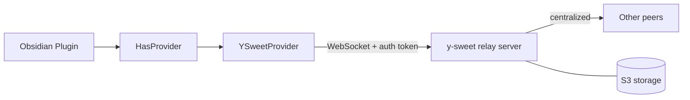
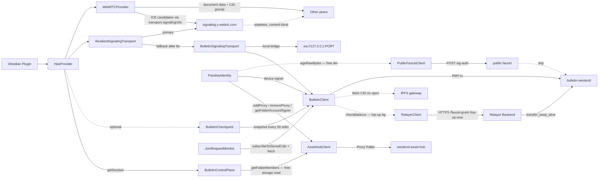
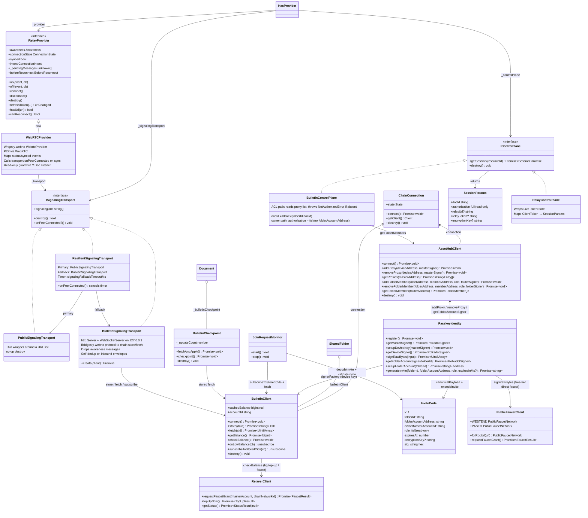
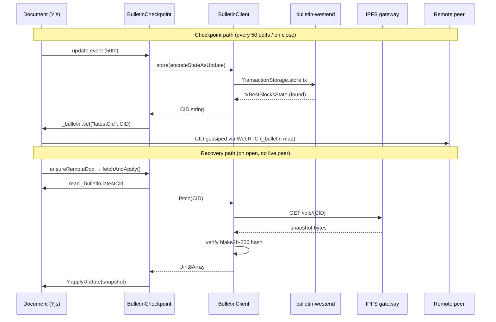
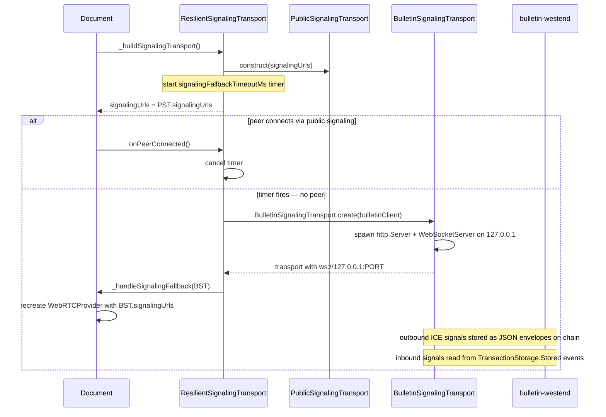
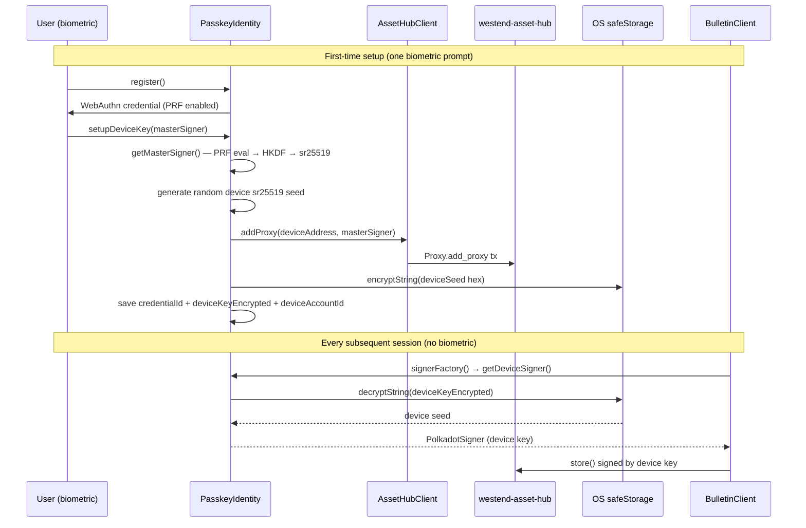
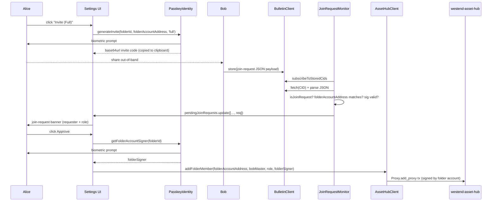
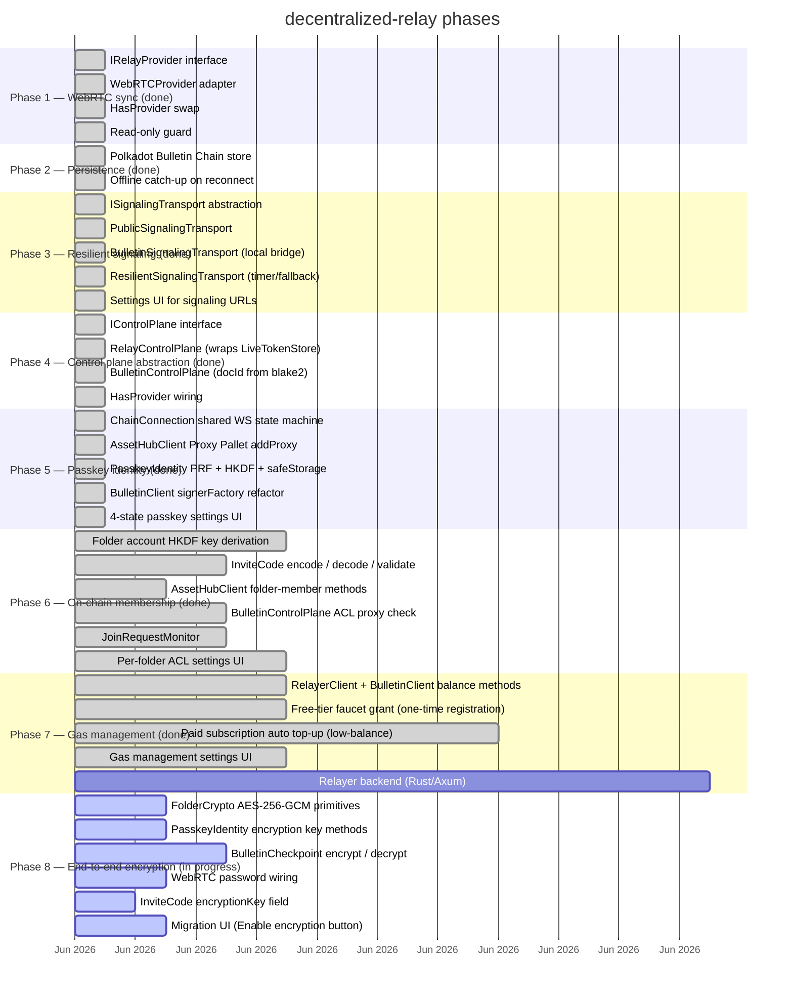

# Technical Architecture — decentralized-relay

Audience: contributors and AI agents. Covers system design, component interfaces, implementation rationale, and known gaps. For the product overview see the root [README.md](../README.md).

---

## Subsystem index

| Subsystem | Phase | Status | Key source files |
|---|---|---|---|
| WebRTC provider adapter | 1 | done | `client/webrtc-provider.ts` |
| Bulletin Chain persistence | 2 | done | `bulletin/BulletinClient.ts`, `bulletin/BulletinCheckpoint.ts` |
| Resilient signaling | 3 | done | `signaling/ResilientSignalingTransport.ts`, `signaling/BulletinSignalingTransport.ts` |
| Control plane abstraction | 4 | done | `control-plane/IControlPlane.ts`, `control-plane/BulletinControlPlane.ts` |
| Passkey identity | 5 | done | `passkey/PasskeyIdentity.ts`, `chain/ChainConnection.ts`, `asset-hub/AssetHubClient.ts` |
| On-chain membership (ACL) | 6 | done | `acl/InviteCode.ts`, `acl/JoinRequestMonitor.ts` |
| Gas management | 7 | done | `bulletin/RelayerClient.ts`, `bulletin/PublicFaucetClient.ts` |
| End-to-end encryption | 8 | in progress | `crypto/FolderCrypto.ts` |

---

## Architecture overview

**Before (upstream Relay):**



**After (this fork):**



Document content travels peer-to-peer. The signaling server sees only room names (= doc IDs) and ICE candidates — never document data. `ResilientSignalingTransport` tries the public server first; if no peer connects within 8 seconds it switches to a local WebSocket bridge backed by the Bulletin Chain. All signaling paths are optional and disabled by default without a configured Bulletin Chain keypair. `BulletinControlPlane` verifies folder membership by reading the proxy list on Asset Hub — a free storage read, no tx required. `JoinRequestMonitor` watches Bulletin Chain for signed join-request payloads and fires a callback for the folder owner to approve.

---

## Component interfaces



---

## Phase logs

### Phase 1 — WebRTC provider swap ✓ done

| File | Change |
|---|---|
| `package.json` | Added `y-webrtc ^10.3.0` |
| `src/client/provider.ts` | Appended `IRelayProvider` interface (reuses existing types) |
| `src/client/webrtc-provider.ts` | **New.** `WebRTCProvider` adapter wrapping `WebrtcProvider` |
| `src/client/__tests__/webrtc-provider.test.ts` | **New.** 22 unit tests (mocked y-webrtc) |
| `src/HasProvider.ts` | `makeProvider()` constructs `WebRTCProvider`; `_provider` typed as `IRelayProvider`; removed `debuggerUrl`; simplified `deferDisconnectForPendingMessages()` |
| `src/SharedFolder.ts` | `subscribeToEvents` call made optional (`?.`) for provider compat |

### Phase 2 — Bulletin Chain persistence ✓ done

The optional Bulletin Chain backup snapshots Yjs document state to the [Polkadot Bulletin Chain](https://github.com/paritytech/polkadot-bulletin-chain) testnet (bulletin-westend). Every 50 edits, and on document close, a snapshot is written to the chain and its CID is distributed to peers via a `_bulletin` Y.Map inside the shared document. On open, `fetchAndApply()` retrieves the last known snapshot and merges it before WebRTC connects — giving reconnecting peers a starting point even when no live peer is available.

**Key design decisions:**

| Question | Decision | Rationale |
|---|---|---|
| CID discovery | `_bulletin` Y.Map inside the Yjs doc | CID syncs to peers via y-webrtc automatically; no separate naming layer |
| Snapshot trigger | Update count (50) + document close | Matches existing IDB compaction semantics; no user action required |
| Chain fetch timing | Always on open, before WebRTC connects | Guarantees best-known state is loaded first; Yjs CRDT merge handles duplicates |
| Failed state | `BulletinClient` enters `failed`; plugin works normally | All failures non-blocking; document always opens and closes successfully |



| File | Change |
|---|---|
| `package.json` | Added `polkadot-api`, `@polkadot/keyring`, `@polkadot/util-crypto`, `@polkadot-api/signer`, `multiformats`, `@polkadot-api/cli` |
| `.papi/` | **New.** Generated PAPI descriptors for `bulletin-westend` chain |
| `src/bulletin/types.ts` | **New.** `BulletinSettings` interface + `DEFAULT_BULLETIN_SETTINGS` |
| `src/bulletin/BulletinClient.ts` | **New.** PAPI WebSocket client: `store(data)` → submits tx + returns CID; `fetch(cid)` → retrieves from IPFS gateway with CID format validation + blake2b-256 content integrity check |
| `src/bulletin/BulletinCheckpoint.ts` | **New.** Per-document coordinator: counts Yjs updates, fires checkpoint at 50, `fetchAndApply()` on open |
| `src/bulletin/__tests__/bulletin-client.test.ts` | **New.** 5 unit tests for BulletinClient |
| `src/bulletin/__tests__/bulletin-checkpoint.test.ts` | **New.** 7 unit tests for BulletinCheckpoint |
| `src/main.ts` | `RelaySettings` extends `BulletinSettings`; `Live` creates/destroys `BulletinClient` in lifecycle; injects into `SharedFolder` |
| `src/SharedFolder.ts` | Added `public bulletinClient: BulletinClient \| null` |
| `src/Document.ts` | `ensureRemoteDoc()` creates `BulletinCheckpoint` + calls `fetchAndApply()`; added `destroyRemoteDoc()` override that fires final checkpoint |
| `src/components/BulletinSettingsSection.svelte` | **New.** Settings UI: enable toggle, RPC URL, keyfile path, password, IPFS gateway |
| `src/components/PluginSettings.svelte` | Added `<BulletinSettingsSection>` to settings panel |

### Phase 3 — Modular resilient signaling ✓ done

The hardcoded `wss://signaling.y-webrtc.com` URL is replaced by a pluggable `ISignalingTransport` abstraction. `WebRTCProvider` accepts any transport; `Document` constructs a `ResilientSignalingTransport` when a `BulletinClient` is available. No self-hosting required; no new centralized service introduced.



**How the chain bridge works:** `BulletinSignalingTransport` opens a local WebSocket server that y-webrtc connects to as its "signaling" server. When y-webrtc publishes an ICE signal, the bridge serialises it into a JSON envelope `{ d: docId, f: accountId, p: payload }` and calls `BulletinClient.store()`. A block-event subscription (`subscribeToStoredCids`) watches for new `TransactionStorage.Stored` events; for each new CID the bridge fetches the bytes, deserialises the envelope, filters out own-account and wrong-room messages, and forwards the rest to y-webrtc's WebSocket client. Awareness messages are dropped — they are not meaningful across chain latency (~6–12 seconds per ICE exchange, acceptable for a cold-start fallback).

| File | Change |
|---|---|
| `package.json` | Added `ws` + `@types/ws` for the local signaling bridge server |
| `src/bulletin/types.ts` | Added `signalingUrls: string[]` and `signalingFallbackTimeoutMs: number` to `BulletinSettings` |
| `src/bulletin/BulletinClient.ts` | Added `accountId` getter (SS58 address) and `subscribeToStoredCids(cb)` (block-event stream) |
| `src/bulletin/__tests__/bulletin-client.test.ts` | +5 tests for new `BulletinClient` methods (total: 10) |
| `src/signaling/ISignalingTransport.ts` | **New.** Interface: `signalingUrls`, `destroy()`, optional `onPeerConnected()` |
| `src/signaling/PublicSignalingTransport.ts` | **New.** Thin wrapper around a URL list; no-op destroy |
| `src/signaling/BulletinSignalingTransport.ts` | **New.** Spawns a local `http.Server` + `WebSocketServer`; bridges y-webrtc signaling to chain `store`/`fetch`; filters awareness messages and deduplicates own-account envelopes |
| `src/signaling/ResilientSignalingTransport.ts` | **New.** Starts with `PublicSignalingTransport`; starts a timer on construction; fires `onFallback(BulletinSignalingTransport)` if no peer connects in time; `onPeerConnected()` cancels the timer |
| `src/signaling/__tests__/public-signaling.test.ts` | **New.** 5 tests |
| `src/signaling/__tests__/bulletin-signaling.test.ts` | **New.** 8 tests |
| `src/signaling/__tests__/resilient-signaling.test.ts` | **New.** 6 tests |
| `src/client/webrtc-provider.ts` | Accepts `transport?: ISignalingTransport` option; calls `transport.onPeerConnected?.()` on first sync; `destroy()` also calls `transport.destroy()` |
| `src/client/__tests__/webrtc-provider.test.ts` | +2 tests for transport option and `onPeerConnected` (total: 24) |
| `src/HasProvider.ts` | Added `_buildSignalingTransport()` (returns `PublicSignalingTransport`); `_handleSignalingFallback()` (swaps provider); threads transport through `ensureRemoteDoc()` |
| `src/Document.ts` | Overrides `_buildSignalingTransport()` — returns `ResilientSignalingTransport` when `bulletinClient` is available |
| `src/components/BulletinSettingsSection.svelte` | Added signaling servers textarea and fallback timeout number input |

### Phase 4 — Control plane abstraction ✓ done

The relay server previously bundled three distinct responsibilities: room naming (issuing `docId`), authorization (signing tokens), and session wiring (WebSocket URL + bearer token). All three were hardcoded into `HasProvider` via `ClientToken`. `IControlPlane` separates these so the relay becomes one swappable implementation.

`SessionParams { docId, authorization, relayUrl?, relayToken? }` replaces `ClientToken` as the currency of session setup inside `HasProvider`. Two implementations ship:

- **`RelayControlPlane`** — wraps `LiveTokenStore`; maps `ClientToken` → `SessionParams`; zero behaviour change for users on the relay path.
- **`BulletinControlPlane`** — derives `docId = blake2AsHex(folderId + ':' + documentId)` locally; no relay server contact needed. Both peers independently compute the same room name from GUIDs they already hold.

A single settings flag picks one at construction time. The relay server becomes optional rather than mandatory. `BackgroundSync` and `LiveTokenStore` are untouched — they continue to serve the relay HTTP file-sync path unchanged.

| File | Change |
|---|---|
| `src/control-plane/IControlPlane.ts` | **New.** `SessionParams` type + `IControlPlane` interface |
| `src/control-plane/RelayControlPlane.ts` | **New.** Wraps `LiveTokenStore`; maps `ClientToken` fields to `SessionParams` |
| `src/control-plane/BulletinControlPlane.ts` | **New.** Pure computation — derives `docId` from blake2 hash of `folderId:documentId` |
| `src/control-plane/__tests__/relay-control-plane.test.ts` | **New.** 7 unit tests |
| `src/control-plane/__tests__/bulletin-control-plane.test.ts` | **New.** 8 unit tests |
| `src/bulletin/types.ts` | Added `bulletinControlPlaneEnabled: boolean` (default `false`) |
| `src/HasProvider.ts` | `clientToken: ClientToken` → `sessionParams: SessionParams`; added `_controlPlane: IControlPlane` constructor param; extracted `_createProvider()` private method; deferred provider creation when `docId` is sentinel; `getProviderToken()` → `getSessionParams()`; `refreshProvider()` only calls relay `refreshToken()` when `relayUrl` present |
| `src/SharedFolder.ts` | Added `public controlPlane: IControlPlane`; passed to `super()` |
| `src/Document.ts` | Passed `parent.controlPlane` to `super()`; null guard in `acquireLock()` for deferred provider path |
| `src/Canvas.ts` | Passed `parent.controlPlane` to `super()` |
| `src/main.ts` | Added `_buildControlPlane()` private method (returns `BulletinControlPlane` or `RelayControlPlane` based on settings) |
| `src/BackgroundSync.ts` | Replaced stale `getProviderToken()` call with direct `tokenStore.getToken()` |

### Phase 5 — Passkey identity ✓ done

Replaces the keyfile + plaintext password UX with hardware-backed biometric authentication.

**How it works:** `PasskeyIdentity` uses the WebAuthn PRF extension to ask the device's secure enclave (Touch ID, Face ID, Windows Hello) for a deterministic 32-byte output given a fixed salt. HKDF-SHA-256 stretches those bytes into an sr25519 seed — the **master account**. No seed phrase is written to disk; on a new device the user touches their fingerprint and the same master account is reconstructed.

The master key is needed only once per device: `setupDeviceKey()` generates a fresh sr25519 **device key**, calls `AssetHubClient.addProxy()` to register the device key as a `NonTransfer` proxy on Westend Asset Hub, then encrypts the device seed with Electron's OS-level `safeStorage` API. From that point all `BulletinClient.store()` calls are signed by the device key retrieved from `safeStorage` — the biometric prompt is not needed again.



**Why device proxy keys (not just master key)?** Stolen device scenario: if a laptop is lost, the device key is the only thing at risk. Revoke it by calling `removeProxy` from any other registered device. The master account — and all folder memberships derived from it — are unaffected. With a keyfile, the whole account is compromised.

**Architecture note:** The Proxy Pallet lives on **Asset Hub** (not Bulletin Chain), so `AssetHubClient` and `BulletinClient` each hold an independent `ChainConnection`. Both connections are created eagerly on plugin load; `BulletinClient` is only instantiated if `bulletin.enabled && bulletin.rpcUrl` are set.

| File | Change |
|---|---|
| `.papi/metadata/westend_asset_hub.scale` | **New.** PAPI descriptor for Westend Asset Hub (Proxy Pallet) |
| `.papi/polkadot-api.json` | Added `westend_asset_hub` chain entry |
| `src/chain/ChainConnection.ts` | **New.** Shared WS + PAPI state machine (`idle → connecting → connected \| failed`); concurrent-connect guard via `_connectPromise` |
| `src/chain/__tests__/chain-connection.test.ts` | **New.** 8 unit tests |
| `src/asset-hub/AssetHubClient.ts` | **New.** Wraps Westend Asset Hub via PAPI; `addProxy` / `removeProxy` / `getProxies` on the Proxy Pallet |
| `src/asset-hub/types.ts` | **New.** `ProxyEntry` type |
| `src/asset-hub/__tests__/asset-hub-client.test.ts` | **New.** 9 unit tests |
| `src/passkey/types.ts` | **New.** `PasskeySettings` interface + `DEFAULT_PASSKEY_SETTINGS`; `ElectronSafeStorage` interface |
| `src/passkey/PasskeyIdentity.ts` | **New.** `register()` — WebAuthn credential with PRF extension; `getMasterSigner()` — PRF eval → HKDF-SHA-256 → sr25519 seed; `setupDeviceKey()` — generates device sr25519, calls `AssetHubClient.addProxy`, stores encrypted seed in OS safeStorage; `getDeviceSigner()` — decrypts from safeStorage |
| `src/passkey/__tests__/passkey-identity.test.ts` | **New.** 19 unit tests |
| `src/bulletin/BulletinClient.ts` | Refactored: now accepts `ChainConnection` + `signerFactory: () => Promise<PolkadotSigner>` instead of keyfile settings |
| `src/bulletin/types.ts` | Added `assetHubRpcUrl: string`; removed `keyfilePath`/`password` fields; renamed `bulletinControlPlaneEnabled` → `controlPlaneEnabled` |
| `src/main.ts` | `RelaySettings` now has nested `bulletin: BulletinSettings` and `passkey: PasskeySettings` namespaces; `onload()` builds `ChainConnection` → `AssetHubClient` → `PasskeyIdentity` unconditionally |
| `src/components/BulletinSettingsSection.svelte` | Replaced keyfile path + password inputs with 4-state passkey identity UI (unregistered → registered → device configured → ready) |

### Phase 6 — On-chain membership ✓ done

Per-folder access control enforced at `getSession()` time via the Asset Hub Proxy Pallet — no relay server, no custom pallet, free storage reads.

**Design choice: why per-folder accounts (not master proxy list).** Three options were evaluated:

| | Option A: master proxy list | Option B: Bulletin Chain record | Option C: per-folder account (chosen) |
|---|---|---|---|
| Per-folder ACL | ❌ all-or-nothing | ✅ | ✅ |
| Role encoding | ❌ none | ✅ full / read-only | ✅ via proxy type convention |
| Read cost | free | IPFS fetch | free |
| New accounts needed | none | none | 1 per folder (dust-funded) |
| Proxy list semantics | ❌ mixes device keys + members | ✅ none | ✅ clean separation |

Option A was ruled out because device keys (Phase 5) and folder members would be indistinguishable on the master's proxy list. Option B was ruled out because `getSession()` is called before the Y.Doc is open — the ACL CID lives in the Y.Doc, creating a chicken-and-egg problem. Option C keeps the master proxy list purely for device keys and uses per-folder accounts for membership.

**Folder accounts.** For each shared folder, Alice derives a dedicated sr25519 **folder account** deterministically from her master seed using a second HKDF pass keyed on the folder UUID. The address is cached in `SharedFolderSettings.folderAccountAddress`; any device with a single biometric touch reconstructs the same keypair.

**Membership.** Authorised members are registered as proxies of the folder account. Proxy type encodes role by convention: `NonTransfer → full`, `Governance → read-only`. `AssetHubClient.addFolderMember` / `removeFolderMember` / `getFolderMembers` wrap the relevant `Proxy.add_proxy` / `remove_proxy` / `Proxies` storage calls.

**Invite flow.**



`JoinRequestMonitor` silently discards payloads that are not `join-request` shaped, reference an unknown folder, or carry an invalid / expired invite signature.

| File | Change |
|---|---|
| `src/asset-hub/types.ts` | Added `FolderMember` interface |
| `src/asset-hub/AssetHubClient.ts` | Added `addFolderMember`, `removeFolderMember`, `getFolderMembers` |
| `src/asset-hub/__tests__/asset-hub-client.test.ts` | +7 unit tests (total: 12) |
| `src/acl/InviteCode.ts` | **New.** `encodeInvite` / `decodeInvite` (base64url) + `validateInvite` (expiry + sr25519 signature) + `canonicalPayload` |
| `src/acl/__tests__/invite-code.test.ts` | **New.** 8 unit tests |
| `src/passkey/PasskeyIdentity.ts` | Added `getFolderAccountSigner`, `setupFolderAccount`, `generateInvite` |
| `src/passkey/__tests__/passkey-identity.test.ts` | +5 unit tests (total: 15) |
| `src/control-plane/IControlPlane.ts` | Added `NotAuthorizedError` class |
| `src/control-plane/BulletinControlPlane.ts` | Constructor now accepts 3 injected deps (`assetHubClient`, `getMyMasterAccountId`, `getFolderAccountAddress`); `getSession` performs ACL check |
| `src/acl/JoinRequestMonitor.ts` | **New.** Subscribes to `BulletinClient.subscribeToStoredCids`; validates shape + folder + invite signature; fires `onRequest` callback |
| `src/acl/__tests__/join-request-monitor.test.ts` | **New.** 6 unit tests |
| `src/SharedFolder.ts` | Added `folderAccountAddress?: string` to `SharedFolderSettings` |
| `src/main.ts` | `_buildControlPlane` wires per-folder address lookup; added `_joinRequestMonitor` + `pendingJoinRequests` store |
| `src/components/BulletinSettingsSection.svelte` | Full replacement: per-folder ACL section + Passkey Identity section |

### Phase 7 — Gas management ✓ done

The Bulletin Chain charges a small transaction fee for each `store()` call. Two funding paths coexist; `BulletinClient.store()` always submits directly to the chain RPC regardless of which path is active.

**Free tier (testnet):** `PublicFaucetClient` requests tokens directly from the public Westend or Paseo faucet — no relayer backend required. The plugin signs a `faucet:<address>:<timestamp>` message with the device key via `PasskeyIdentity.signRawBytes` and POSTs the sr25519 signature. Token network (WND / PAS) is auto-detected from the configured RPC URL. The public faucet allows one grant per day.

**Paid tier (production):** A flat monthly subscription keeps the device account topped up automatically. When the balance drops below a threshold, the plugin triggers a refill in the background — sync is never blocked.

**`checkBalance()` is never called inside `store()`.** Balance is checked on plugin load and when the settings panel opens. If a tx fails due to truly zero balance, the chain error propagates and the UI surfaces it — this should not happen under normal operation.

**Payment backend's role is narrowly scoped to account funding only.** It holds no document content, no cryptographic keys, and no signatures. It cannot read or modify sync state.

| File | Change |
|---|---|
| `src/bulletin/types.ts` | Added `relayerUrl`, `subscriptionToken`, `lowBalanceThreshold` to `BulletinSettings` |
| `src/bulletin/RelayerClient.ts` | **New.** HTTP client for `/faucet-grant`, `/top-up-now`, `/status` — discriminated-union result types; all network errors caught and returned as typed reasons |
| `src/bulletin/__tests__/relayer-client.test.ts` | **New.** 16 unit tests |
| `src/bulletin/BulletinClient.ts` | Added `getBalance()`, `checkBalance()`, `onLowBalance(cb)`, `cachedBalance` |
| `src/bulletin/__tests__/bulletin-client.test.ts` | +8 tests (total: 19) |
| `src/main.ts` | Constructs `RelayerClient` when `relayerUrl` is set; passes it to `BulletinClient`; calls `checkBalance()` on startup |
| `src/components/BulletinSettingsSection.svelte` | Added balance display, free-tier faucet button, paid-subscription status panel, relayer URL + token + threshold fields |
| `jest.config.js` | Fixed `testPathIgnorePatterns` to allow tests to run inside `.claude/worktrees/` |
| `src/passkey/PasskeyIdentity.ts` | Added `signRawBytes(input): Promise<Uint8Array>` — raw sr25519 signing for faucet auth |
| `src/bulletin/PublicFaucetClient.ts` | **New.** `forRpcUrl` detects Westend vs Paseo; signature-authenticated POST to public faucet; NDJSON response parsed |
| `src/bulletin/__tests__/public-faucet-client.test.ts` | **New.** 10 unit tests |

The Relayer backend is closed-source (not in this repo). The plugin side (`RelayerClient`) is fully implemented; the backend is a separate service. See Deferred gaps.

### Phase 8 — End-to-end encryption (in progress)

Phases 1–7 left note content exposed: snapshots are stored as plaintext on Bulletin Chain / IPFS, and CRDT updates travel unencrypted over WebRTC. Phase 8 closes both gaps with a single per-folder symmetric key.

**Key derivation.** `PasskeyIdentity` derives a 32-byte AES-256 key from the passkey master seed and folder UUID via a second HKDF pass (`info = folderId + ":encryption-v1"`). The key is deterministic — reproducible from a passkey touch alone if settings are lost — and stored encrypted in OS safeStorage.

**Snapshot encryption.** `BulletinCheckpoint` encrypts Yjs state bytes with AES-256-GCM before calling `BulletinClient.store()`. Wire format: `[0x01 version][12-byte nonce][ciphertext + GCM auth tag]`. On `fetchAndApply()`, a missing version byte or decryption failure falls back gracefully — the document loads from peers. `BulletinClient` is unchanged (remains a dumb byte pipe).

**WebRTC encryption.** The same hex key is passed as `password` to y-webrtc's `WebrtcProvider`. y-webrtc internally runs PBKDF2 to derive its AES-CBC working key, so the two layers never share actual key bytes.

**Key distribution.** The key is embedded in invite codes (alongside the existing ACL fields). Members receive it on join and store it in their own safeStorage.

**Migration.** Existing folders continue to work — `fetchAndApply` detects the missing version byte and skips the snapshot, loading from peers instead. `checkpoint` silently skips if no key is configured. Old unencrypted CIDs remain on IPFS indefinitely and cannot be removed retroactively. Upgrading encrypts from the point of enabling — it does not protect historical snapshots.

| File | Change |
|---|---|
| `src/crypto/FolderCrypto.ts` | **New.** `encrypt(key, plaintext)` / `decrypt(key, ciphertext)` wrappers around `crypto.subtle` |
| `src/crypto/__tests__/folder-crypto.test.ts` | **New.** Round-trip + failure path tests |
| `src/passkey/PasskeyIdentity.ts` | Added `setupFolderEncryptionKey`, `getFolderEncryptionKey`, `getFolderEncryptionKeyHex` |
| `src/bulletin/BulletinCheckpoint.ts` | Encrypt before `store()`, decrypt after `fetch()` |
| `src/control-plane/IControlPlane.ts` | Added `encryptionKey?: string` to `SessionParams` |
| `src/control-plane/BulletinControlPlane.ts` | Added `getFolderEncryptionKeyHex` dep; includes key in `getSession()` result |
| `src/client/webrtc-provider.ts` | Accepts `password?` in options; forwards to inner `WebrtcProvider` |
| `src/HasProvider.ts` | Passes `sessionParams.encryptionKey` as `password` to `WebRTCProvider` |
| `src/acl/InviteCode.ts` | Added `encryptionKey?` field; included in canonical payload |
| `src/components/BulletinSettingsSection.svelte` | Added "Enable encryption" button for folders with `folderAccountAddress` but no key yet |

---

## Behaviour mapping

| YSweetProvider behaviour | WebRTCProvider equivalent |
|---|---|
| `status` event → `{ status, intent }` | Inner `status` event remapped from `{ connected }` |
| `synced` event → `boolean` | Inner `synced` event remapped from `{ synced }` |
| `connection-close` event | Emitted when inner `status.connected === false` |
| `refreshToken(url, …)` | No-op — returns `{ urlChanged: false }` |
| `hasUrl(url)` | Always `true` |
| `canReconnect()` | Always `true` |
| `_pendingMessages` | Always `[]` |
| `readOnly` enforced by server | Console error on local writes (see Limitations) |

---

## Known limitations

### Security / access control

| Limitation | Detail |
|---|---|
| **No transport-level auth** | Room name = `sessionParams.docId` (non-guessable GUID for relay path; blake2 hash for bulletin path). Any peer who learns the docId can join WebRTC. On-chain ACL (Phase 6) verifies membership at session-open time, but WebRTC itself has no server to eject unauthorised peers. |
| **Read-only not enforced** | WebRTC is symmetric — there is no server to reject writes from read-only clients. `WebRTCProvider` logs a `console.error` when a local write occurs on a read-only token. Full enforcement requires a gated signaling server or custom pallet. |
| **No encryption** until Phase 8 | Snapshots stored on Bulletin Chain / IPFS are currently plaintext. y-webrtc CRDT updates are unencrypted in-flight. Phase 8 adds AES-256-GCM snapshot encryption and wires the y-webrtc `password` option. |

### Protocol gaps

| Limitation | Detail |
|---|---|
| **Offline persistence + resilient signaling (experimental)** | The optional Bulletin Chain features (disabled by default) require a funded sr25519 keypair on bulletin-westend and a configured RPC URL. |
| **Subdoc sync disabled** | `subscribeToEvents`, `getSubdocQueryDocIds`, `onSubdocIndex` are y-sweet–specific. `WebRTCProvider` exposes them as optional no-ops. |
| **No `connection-error` on ICE failure** | y-webrtc does not surface ICE negotiation failures as an event. No plan to address without upstream changes. |
| **Testnet persistence** | The free tier runs on bulletin-westend / paseo testnet. Testnet chains can reset, which would erase stored snapshots; persistence is best-effort. |

---

## Roadmap



---

## Deferred gaps

### High priority — incomplete features with plugin-side stubs built

**Relayer backend**
The plugin has a complete `RelayerClient` with `/faucet-grant`, `/top-up-now`, `/status` endpoints wired. There is no backend to receive these calls. The paid subscription tier is entirely non-functional until this ships. The backend is closed-source and developed separately.

**Folder discovery**
Bob can be approved as a folder member (proxy added on Asset Hub) but has no automated way to get the folder into his Obsidian vault. The invite code carries only ACL data (`folderId`, `folderAccountAddress`, role) — not the folder's name, vault path, or plugin settings. Bob must receive this metadata out-of-band. Proposed fix: embed folder metadata in the invite code and/or add a lightweight rendezvous endpoint.

### Medium priority — UX gaps, no stubs built

**Multi-device management**
`PasskeyIdentity.addDevice()` — allow a second laptop to register by touching the passkey on any existing registered device. Currently a user with a new device must redo full setup from scratch.

**Revocation UI**
No UI to list all registered device keys (query Asset Hub proxies by master account) or revoke one. Revocation logic exists (`AssetHubClient.removeProxy`) but there is no surface to invoke it for device keys.

**JoinRequestMonitor auto-approve allowlist**
Today every join request requires manual approval by Alice. A pre-signed allowlist (Bob's master account ID) would let Alice auto-approve known contacts without a UI interaction.

**Invite delivery via rendezvous endpoint**
Invite codes are currently copy-pasted manually. A short-lived rendezvous endpoint (POST invite → short code, recipient polls or receives push) would remove manual transfer.

### Low priority — protocol limitations, no plan yet

**Read-only enforcement**
WebRTC is symmetric — no server can reject writes from read-only members. Full enforcement requires a gated signaling server or custom pallet.

**`connection-error` events on ICE failure**
y-webrtc does not surface ICE negotiation failures as events. No plan to address without upstream changes.

**Token-gated room admission at signaling layer**
Any peer who learns the docId (blake2 hash) can join the WebRTC room. Phase 6 ACL checks at session-open time but does not eject unauthorised peers mid-session.

---

## Development

```bash
npm install
npm run build   # tsc + esbuild (develop profile)
npm test        # jest unit tests (~193 tests across WebRTC, Bulletin Chain, signaling, passkey, asset-hub, control-plane, ACL, invite-code, gas management, and public faucet layers)
```

The encrypted test files copied from the upstream repo (`__tests__/**` except `src/client/__tests__/`) require the upstream git-crypt key and cannot be run in this fork without it.
